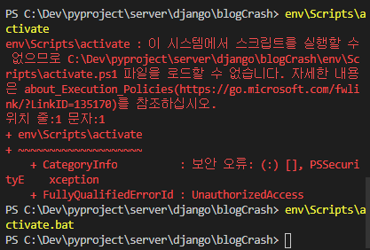
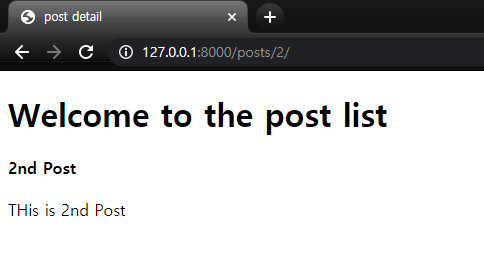

# blog crash course

이 repository 안의 모든 코드는 유투브 영상인 django crash course for beginners(https://youtu.be/_04toQWN5-8)를 따라가면 만들어진 결과물입니다.

## 1. Environmental settings

```cmd
pip install virtualenv
virtualenv env
env\Scripts\activate.bat
```

이때 마지막 줄에서 .bat을 끝에 붙이지 않으면 에러가 난다.



> 주의: anaconda가 설치되어 있는 상태에서는 가상환경인 env를 실행하기 어려운 듯하다.

```cmd
pip install django
django-admin startproject blog
# \blog => \src
cd src
python manage.py runserver
# 서버가 잘 작동하는 지 확인하기
python manage.py startapp posts
```

그리고 \src\blogs\settings.py의 installed app에

```py
INSTALLED_APPS = [
    'django.contrib.admin',
    'django.contrib.auth',
    'django.contrib.contenttypes',
    'django.contrib.sessions',
    'django.contrib.messages',
    'django.contrib.staticfiles',
    'posts'
]
```

를 작성한다.

## 2. Post class 만들기

(0) models.py에 작업하기

\src\posts\models.py에서 아래와 같이 Post를 만들어 준다.

```py
from django.db import models

class Post(models.Model):
    title = models.CharField(max_length=40)
    content = models.TextField()

    def __str__(self):
        return self.title
```

그리고 cmd 창에 아래와 같이 적어준다.

```cmd
python manage.py makemigrations
python manage.py migrate
```

(1) views.py 수정하기

```py
from .models import Post

def post_list(request):
    posts = Post.objects.all()
    context = {
        "post_list": posts
    }
    return render(request, 'post_list.html', context)
```

(2) urls.py 수정하기

```py
# src\posts\urls.py
from django.urls import path
# 아래가 추가한 코드들
from .views import post_list

urlpatterns = [
    path('', post_list)
]
```

```py
# src\blog\urls.py
from django.contrib import admin
from django.urls import path, include

urlpatterns = [
    path('admin/', admin.site.urls),
    # 아래가 추가한 코드
    path('posts/', include('posts.url'))
]
```

(3) admin.py 수정하기

```py
from django.contrib import admin
# 아래가 수정한 코드들
from .models import Post

admin.site.register(Post)
```

(4) settings.py 수정하기

```py

TEMPLATES = [
    {
        'BACKEND': 'django.template.backends.django.DjangoTemplates',
        # 아래가 수정한 코드
        'DIRS': [os.path.join(BASE_DIR, 'templates')],
        'APP_DIRS': True,
        'OPTIONS': {
            'context_processors': [
                'django.template.context_processors.debug',
                'django.template.context_processors.request',
                'django.contrib.auth.context_processors.auth',
                'django.contrib.messages.context_processors.messages',
            ],
        },
    },
]
```

(5) post_list.html

```html
<!DOCTYPE html>
<html lang="en">
    <head>
        <meta charset="UTF-8" />
        <meta name="viewport" content="width=device-width, initial-scale=1.0" />
        <title>postlist</title>
    </head>
    <body>
        <h1>Welcome to the post list</h1>
        <ul>
            
            <li>{{post}}</li>
            
        </ul>
    </body>
</html>
```

## 3. post_detail 만들어주기

http://127.0.0.1:8000/posts/1 을 ip address로 쳤을 때 id=1을 가진 Post를 보여주는 걸 해 보자.

### src/posts/views.py

```py
# 원래 코드에 아래 코드 추가하기
def post_detail(request, post_id):
    post = Post.objects.get(id=post_id)      # get()이라는 것에 주의하기
    context = {
        'post': post
    }
    return render(request, 'post_detail.html', context)
```

### src/posts/urls.py

```py
from django.urls import path
from .views import post_list, post_detail

urlpatterns = [
    path('', post_list),
    path('<post_id>/', post_detail)
]

```

### /src/templates/post_detail.html

```html
<!DOCTYPE html>
<html lang="en">
    <head>
        <!-- 생략 -->
    </head>
    <body>
        <h1>Welcome to the post list</h1>
        <h4>{{post.title}}</h4>
        <p>{{post.content}}</p>
    </body>
</html>
```

### 결과



## 4. post 생성하는 화면 만들기

이번에는 post를 사용자가 생성할 수 있는 화면을 만들어보자.
즉, http://127.0.0.1:8000/posts/create/ 로 post title, post content를 작성해서 submit 버튼을 누르면 http://127.0.0.1:8000/posts/ 화면으로 돌아가 작성했던 post title을 포함하여 지금까지 작성한 걸 보여준다.

\src\posts\forms.py

```py
from django import forms
from .models import Post

class PostForm(forms.ModelForm):
    class Meta:
        model = Post
        fields = [
            'title',
            'content'
        ]
```

\src\post\views.py

```py
from .forms import PostForm

def post_create(request):
    # TODO: 아래 세 줄의 의미 찾기
    form = PostForm(request.POST or None)
    if form.is_valid():
        form.save()
        # end the function and call httpresponseRedirect, so that we can go back to the root.
        return HttpResponseRedirect('/posts')

    context = {
        "form": form
    }

    return render(request, "post_create.html", context)
```

\src\post\urls.py

```py
from django.urls import path
from .views import post_list, post_detail, post_create

urlpatterns = [
    path('', post_list),
    # 아래 두줄의 순서를 바꾸면 http://127.0.0.1:8000/posts/create 가 에러가 뜸.
    path('create/', post_create),
    path('<post_id>/', post_detail),

]
```

\src\templates\post_create.html

```html
<!DOCTYPE html>
<html lang="en">
    <head>
        <!-- 생략 -->
    </head>
    <body>
        <h1>Welcome to the post create page</h1>
        <form method="POST" action=".">
            <!-- csrf token은 보안상 문제를 해결해주는? 토큰임. 이거 없으면 csrf token 에러 어쩌구가 뜸.-->
            <!-- form.as_p에서 as_p를 추가하면 각 form의 요소들을 p 태그를 부과한 것 같은 효과를 주는 듯하다 -->
             {{form.as_p}}
            <button type="submit">Create Post</button>
        </form>
    </body>
</html>
```

## 5. post 수정하는 화면 만들기(post_update)

http://127.0.0.1:8000/posts/2/update 를 하면 id=2인 post를 수정하고 http://127.0.0.1:8000/posts/ 화면이 뜨게 된다.

\src\post\views.py

```py
# 원래 코드에서 post_create 수정하기
def post_create(request):
    # TODO: 아래 세 줄의 의미 찾기
    form = PostForm(request.POST or None)
    if form.is_valid():
        form.save()
        # end the function and call httpresponseRedirect, so that we can go back to the root.
        return HttpResponseRedirect('/posts')
    context = {
        "form": form,
        # 아래 코드 수정하기
        'form_type': 'Create'
    }

    return render(request, "post_create.html", context)

# 원래 코드에 아래 코드 추가하기
def post_update(request, post_id):
    post = Post.objects.get(id=post_id)
    # 여기서 instance의 의미는?
    form = PostForm(request.POST or None, instance=post)
    if form.is_valid():
        form.save()
        return HttpResponseRedirect('/posts')
    context = {
        "form": form,
        'form_type': 'update'
    }
    return render(request, "post_create.html", context)

```

\src\post\urls.py

```py
from django.urls import path
from .views import post_list, post_detail, post_create, post_update, post_delete

urlpatterns = [
    path('', post_list),
    path('create/', post_create),

    path('<post_id>/', post_detail),
    path('<post_id>/update/', post_update),
]
```

\src\templates\post_create.html

```html
<!DOCTYPE html>
<html lang="en">
    <head>
        <!-- 생략 -->
    </head>
    <body>
        <!-- 아래 코드가 수정한 코드1 -->
        <h1>Welcome to the {{form_type}} page</h1>
        <form method="POST" action=".">
             {{form.as_p}}
            <!-- 아래 코드가 수정한 코드2 -->
            <button type="submit">{{form_type}} Post</button>
        </form>
    </body>
</html>
```

## 6. post 삭제하는 화면 만들기(post_update)

http://127.0.0.1:8000/posts/2/delete 를 하면 id=2인 post가 삭제되고 http://127.0.0.1:8000/posts/ 화면이 뜬다.

\src\post\views.py

```py
# 원래 코드에 아래 코드 추가하기
def post_delete(request, post_id):
    post = Post.objects.get(id=post_id)
    post.delete()
    return HttpResponseRedirect('/posts')
```

\src\post\urls.py

```py
from django.urls import path
from .views import post_list, post_detail, post_create, post_update, post_delete

urlpatterns = [
    path('', post_list),
    path('create/', post_create),

    path('<post_id>/', post_detail),
    path('<post_id>/update/', post_update),
    path('<post_id>/delete/', post_delete)
]
```

## 확장하기

1. posts/에서 링크로 posts/{id} 갈 수 있도록 하기
